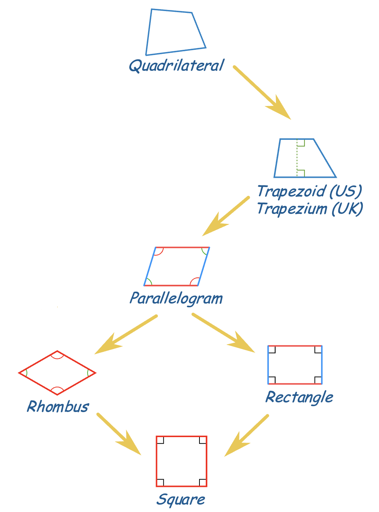
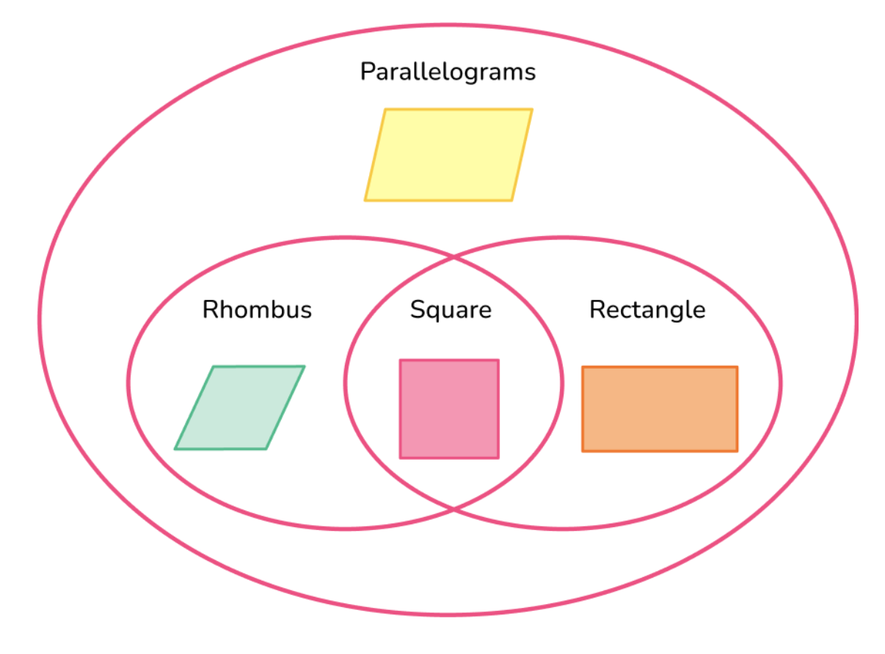

# 正方形

## 正方形的定义
!!! info "定义：正方形"
    **定义：** 有四条边相等，并且有四个角是直角的四边形叫做**正方形**。

    **1. 双向等价关系：**
    $$
    \text{四条边都相等且四个角都是直角} \iff \text{该四边形是正方形}
    $$

    **2. 概念关系提示：**
    
     **正方形 = 矩形 + 菱形**
     
     *   既是矩形又是菱形的四边形是正方形。
     *   有一组邻边相等的矩形是正方形。
     *   有一个内角是直角的菱形是正方形。

*图片来源: [Maths Is Fun](https://www.mathsisfun.com/quadrilaterals.html)*

*图片来源: [Third Space Learning](https://thirdspacelearning.com/us/math-resources/topic-guides/geometry/parallelograms/)*

