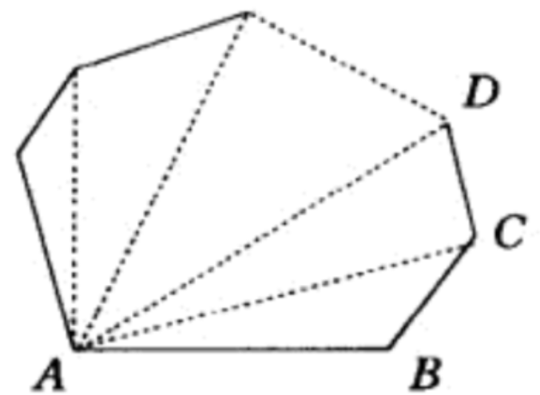
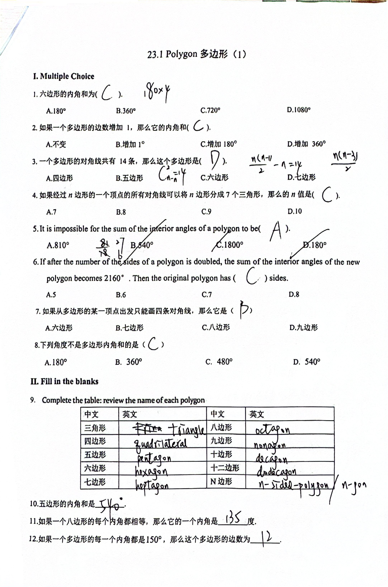
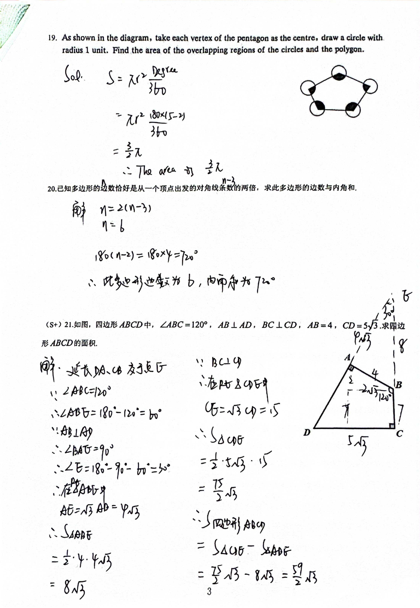

# 多边形

在同一平面内，由不在同一直线上的三条或三条以上的线段首尾顺次连接所组成的封闭图形，叫作**多边形**。

## 知识点

### 多边形的名称

| 边数 | 中文名 | 英文名 |
| :--- | :--- | :--- |
| 3 | 三角形 | Triangle |
| 4 | 四边形 | Quadrilateral |
| 5 | 五边形 | Pentagon |
| 6 | 六边形 | Hexagon |
| 7 | 七边形 | Heptagon |
| 8 | 八边形 | Octagon |
| 9 | 九边形 | Nonagon |
| 10 | 十边形 | Decagon |
| 11 | 十一边形 | Hendecagon |
| 12 | 十二边形 | Dodecagon |

??? info "拓展：拉丁语和希腊语中的数"

    === "拉丁语"

        | 数 | 拉丁语基数词 (Cardinal) | 拉丁语序数词 (Ordinal) | 英语衍生词参考 |
        | :--- | :--- | :--- | :--- |
        | 1 | Unus | Primus | Unicycle / Primary |
        | 2 | Duo | Secundus | Duet / Secondary |
        | 3 | Tres | Tertius | Trio / Tertiary |
        | 4 | Quattuor | Quartus | Quarter / Quartet |
        | 5 | Quinque | Quintus | Quintuplets / Quintessential |
        | 6 | Sex | Sextus | Sextet / Sextant |
        | 7 | Septem | Septimus | September / Septimal |
        | 8 | Octo | Octavus | Octopus / Octave |
        | 9 | Novem | Nonus | November / Nonagon |
        | 10 | Decem | Decimus | December / Decimal |
        | 11 | Undecim | Undecimus | Undecimal |
        | 12 | Duodecim | Duodecimus | Duodecimal |

    === "希腊语"

        | 数 | 希腊语基数词 (Cardinal) | 希腊语序数词 (Ordinal) | 英语衍生词参考 |
        | :--- | :--- | :--- | :--- |
        | 1 | Heis / Hen | Prōtos | Henagon / Prototype |
        | 2 | Duo | Deuteros | Digraph / Deuteronomy |
        | 3 | Treis | Tritos | Trigon / Tritium |
        | 4 | Tettares | Tetartos | Tetrapod / Tetrarch |
        | 5 | Pente | Pemptos | Pentagon / Pentameter |
        | 6 | Hex | Hektos | Hexagon / Hexagram |
        | 7 | Hepta | Hebdomos | Heptathlon / Hebdomadal |
        | 8 | Oktō | Ogdoos | Octogon / Ogdoad |
        | 9 | Ennea | Enatos | Enneagon / Ennead |
        | 10 | Deka | Dekatos | Decagon / Decalogue |
        | 11 | Hendeka | Hendekatos | Hendecagon |
        | 12 | Dōdeka | Dōdekatos | Dodecahedron |

### 凸多边形和凹多边形

对于一个多边形，如果画出它的任意一边所在的直线时，其余各边都在这条直线的同一侧，那么这个多边形叫作**凸多边形**；否则叫作**凹多边形**。

本章节中，我们只讨论凸多边形。

### 多边形内角和

{ align=right width=30% }
众所周知，三角形内角和是 $180^\circ$。把它推广到四边形，把四边形延对角线切割，得到两个三角形，因此四边形内角和是 $360^\circ$。

如图，对于 $n$ 边形，钦定一个顶点，延以这个顶点为端点的 $n-3$ 条对角线切割多边形，得到 $n-2$ 个三角形，因此 $n$ 边形的内角和是：

$$
(n-2)180^\circ
$$

### 多边形外角和

## 作业答案

<!--  -->